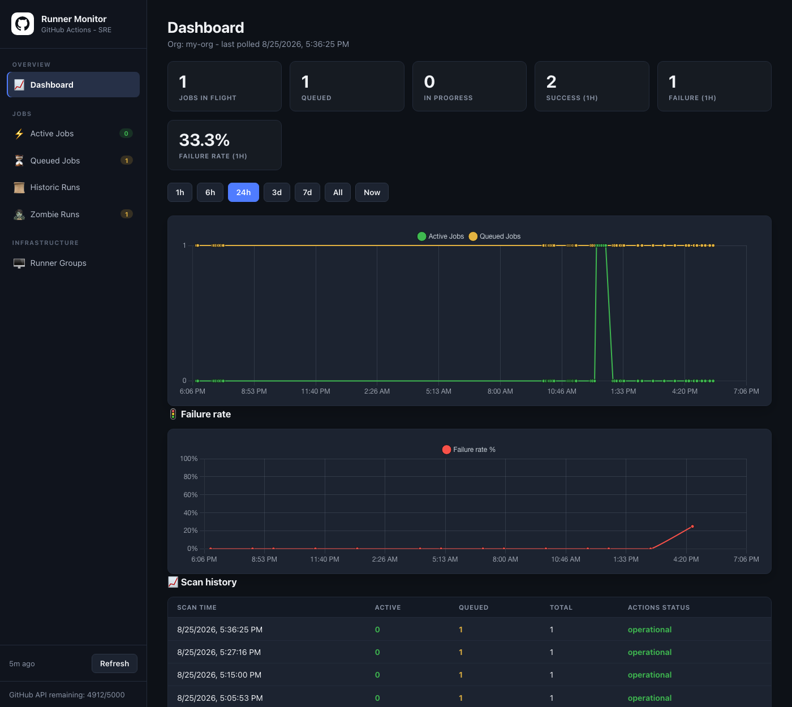
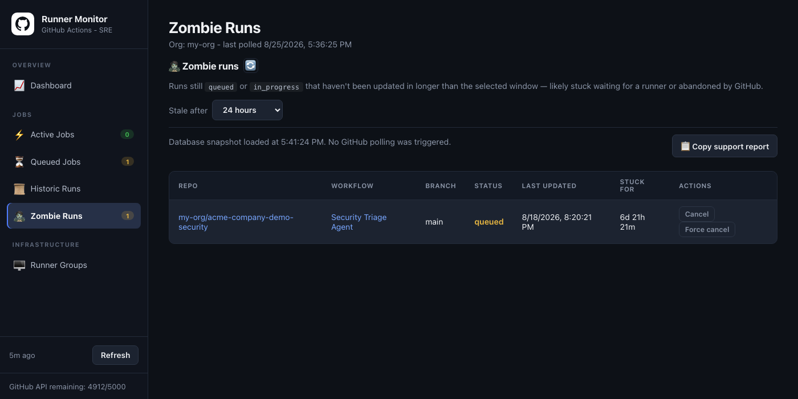
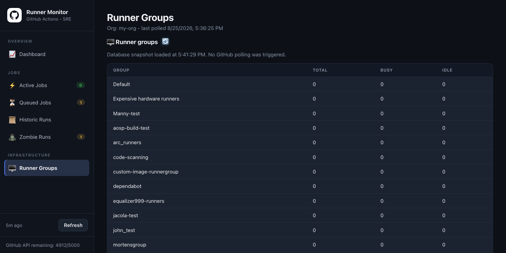

# GitHub Actions Monitor

A small always-on web app that gives you a single pane of glass over
GitHub Actions for one organization: jobs in flight, queue depth (queued
vs. in-progress), recent workflow run outcomes, and runner group capacity.

Built for **GHES** (GitHub Enterprise Server) first, and works against
**GitHub.com / GHEC** with configuration only — see [GHEC_TODO.md](GHEC_TODO.md)
for instance-targeting details and known gaps.

> [!WARNING]
> This is an independent open-source project, not an official GitHub product,
> and is not affiliated with, endorsed by, or supported by GitHub. "GitHub",
> "GitHub Actions", and "GitHub Enterprise Server" are trademarks of GitHub,
> Inc. Use of this project does not grant any license to GitHub trademarks.

## Disclaimer

This software is provided under the [MIT License](LICENSE), without warranty
or guarantee of availability, accuracy, security, or fitness for a particular
purpose. It is intended as an operational aid, not as a replacement for
GitHub's own controls, monitoring, audit logs, backups, or incident-response
processes. Validate it in a non-production environment before deployment and
review all permissions and network exposure for your environment.

The monitor can persist workflow data and expose controls that cancel workflow
runs. Keep its database, logs, configuration, credentials, and webhook secrets
protected. See [SECURITY.md](SECURITY.md) for deployment guidance and
vulnerability reporting.

## Current scope (MVP)

- Live workflow run feed via an inbound org webhook (`workflow_run` events).
- Periodic API polling as a backstop: spot-checks only the repos webhooks
  reported as recently active for missed completions, and polls runner
  group capacity (busy/idle/total).
- A minimal dashboard and JSON API showing queue depth history, active/queued
  jobs, runner group snapshots, and stored workflow runs, with guarded
  cancellation controls for active runs.

Explicitly **out of scope** for this MVP (see `GHEC_TODO.md` for notes on
reintroducing them later): health probes, incident detection, Slack
alerting, GitHub App inventory, Okta-gated auth. Auth for the initial
version is a single admin PAT (no OAuth yet).

## Screenshots

**Dashboard** — live queue depth and failure-rate charts, plus scan history:



**Zombie Runs** — queued/in-progress runs stuck past a configurable staleness window:



**Runner Groups** — busy/idle/total capacity per self-hosted runner group:



## How it works

1. **Webhook (push)** — configure an org webhook pointing at
   `POST /webhook/github` for the `workflow_run` event. This is the primary,
   most reliable signal, and the background poller depends on it: the
   scheduled active-run sweep only checks repos webhooks have recorded as
   recently active, so it stays cheap but relies on webhook deliveries to
   know where to look.
2. **Poller (pull)** — on a schedule, spot-checks those recently-active repos
   via the GitHub REST API to catch any completion webhook that was missed,
   and polls runner group capacity. If the store has no recently-active
   repos at all (fresh install, or webhooks never configured), it runs one
   automatic one-time full-org history bootstrap so the spot-check has
   something to work with. A full-org historic run backfill is otherwise
   manual-only via the dashboard's **Refresh** action.
3. **Refresh (manual, webhook-independent)** — the dashboard's **Refresh**
   button (`POST /api/refresh`) synchronously runs the active-run sweep,
   a full-org history sweep, and the runner-capacity poll, regardless of
   webhook history. This means the monitor can be run entirely without a
   webhook configured, as long as Refresh is triggered periodically (by a
   person or a scheduled call) — the background poller's low-cost scheduled
   sweep is what depends on webhooks, not the app as a whole.
4. **Store** — everything is persisted to a local SQLite database
   (pure Go driver, no CGO) so history survives restarts/redeploys. Point
   `DB_PATH` at a mounted volume in production.
5. **Dashboard/API** — a static HTML dashboard (`web/static/index.html`)
   polls the JSON API every 10s to show current status.

## Configuration

All configuration is via environment variables (see `internal/config`):

| Variable | Required | Default | Notes |
|---|---|---|---|
| `GITHUB_ORG` | yes | — | Org to monitor. |
| `GHES_BASE_URL` | no | unset (→ GHEC) | e.g. `https://ghes.example.com`. Leave unset or set to `https://github.com` to target GHEC. |
| `GITHUB_ADMIN_TOKEN` | one of this or App creds | — | Admin PAT, used for all API calls in the MVP. |
| `GITHUB_APP_ID` / `GITHUB_APP_INSTALLATION_ID` / `GITHUB_APP_PRIVATE_KEY` | one of this or admin token | — | GitHub App identity, used instead of the admin PAT for least-privilege polling. |
| `GITHUB_WEBHOOK_SECRET` | no | — | HMAC secret for verifying inbound webhook deliveries. Strongly recommended in production. |
| `AUTH_USERNAME` / `AUTH_TOKEN` | no (both required together) | — | Enables HTTP Basic Auth on the dashboard and API (not the webhook receiver, which uses `GITHUB_WEBHOOK_SECRET` instead). If unset, the dashboard/API have no built-in auth and **must** be placed behind an authenticating proxy. |
| `DB_PATH` | no | `data/monitor.db` | SQLite database file path. |
| `PORT` | no | `8080` | HTTP listen port. |
| `WORKFLOW_POLL_INTERVAL` | no | `5m` | Any Go duration string. Active (queued/in_progress) run reconciliation sweep. Webhooks provide the primary live signal. |
| `RUNNER_POLL_INTERVAL` | no | `10m` | Any Go duration string. |

### `GITHUB_ADMIN_TOKEN` permissions

The admin PAT needs organization-level access, since it lists every repo,
reads workflow runs, cancels runs, and reads self-hosted runner group
capacity for the whole org:

- **Classic PAT** (required for GHES; also works on GHEC) — scopes:
  - `repo` (full control of private repos) — required to read workflow runs
    and cancel/force-cancel them across all repos, including private ones.
  - `admin:org` — required to list org repos and read runner groups /
    self-hosted runners (`GET /orgs/{org}/actions/runner-groups`, etc.).
- **Fine-grained PAT** (GHEC only) — organization permissions:
  - Actions: **Read and write** (read workflow runs, cancel/force-cancel).
  - Administration: **Read-only** (list org repos).
  - Self-hosted runners: **Read-only** (runner group capacity).

Prefer the GitHub App credentials (`GITHUB_APP_ID` /
`GITHUB_APP_INSTALLATION_ID` / `GITHUB_APP_PRIVATE_KEY`) for the polling
path when available — grant the same Actions/Administration/Self-hosted
runners permissions at the app level. The admin PAT remains the
administrative credential used for cancellation and as the fallback for
polling when App credentials aren't configured.

## Running locally

```sh
export GITHUB_ORG=my-org
export GITHUB_ADMIN_TOKEN=ghp_xxx
export GHES_BASE_URL=https://ghes.example.com   # omit for GHEC
go run ./cmd/server
```

Then open http://localhost:8080.

## License

Released under the [MIT License](LICENSE). Third-party dependencies and
vendored assets remain under their respective licenses; see
[THIRD_PARTY_NOTICES.md](THIRD_PARTY_NOTICES.md) for the vendored Chart.js
notice.

## Running with Docker

```sh
docker build -t ghes-actions-monitor .
docker run -p 8080:8080 \
  -e GITHUB_ORG=my-org \
  -e GITHUB_ADMIN_TOKEN=ghp_xxx \
  -e GHES_BASE_URL=https://ghes.example.com \
  -v monitor-data:/data \
  ghes-actions-monitor
```

The image is a distroless, CGO-free static binary — no OS package
dependencies at runtime. It's designed to also run well as a managed
container (e.g. Google Cloud Run): respects `PORT`, and expects `DB_PATH`
on a persistent volume/mount so history survives redeploys.

## API endpoints

- `GET /healthz` — liveness probe.
- `GET /api/status` — org queue depth, in-flight count, recent (1h) outcomes.
- `GET /api/runs/recent?limit=N` — most recent workflow run states.
- `GET /api/runners` — latest runner group capacity snapshots.
- `GET /api/queue-depth/history?hours=N` — queued vs. in-progress snapshots for the dashboard chart.
- `POST /api/refresh` — manually refresh active runs, recent history, and runner capacity.
- `POST /api/runs/{run_id}/cancel` — cancel or force-cancel an active workflow run.
- `POST /webhook/github` — inbound org webhook receiver (`workflow_run`).

The cancel endpoint is constrained to `GITHUB_ORG`, but this MVP does not yet
authenticate dashboard/API users itself. Deploy it behind an authenticating
proxy such as Okta/IAP and restrict direct network access before exposing
`POST /api/runs/{run_id}/cancel`.

## Development

```sh
go build ./...
go vet ./...
gofmt -l .            # should print nothing
go test ./... -cover
```

CI (`.github/workflows/ci.yml`) runs the above plus a coverage gate
(≥80%) and a Docker build on every push/PR.

## Deployment

Pushes to `main` deploy to the Fly.io app configured in `fly.toml` after CI
passes. Configure the repository secret `FLY_API_TOKEN` with a Fly.io deploy
token; pull requests run CI but do not deploy.